# SophRia Limousine Services — System Design

_Toronto Pearson (YYZ) chauffeur & airport-transfer platform. ~90% of business is Pearson airport transfers._

> **Status:** this document reflects the codebase on branch `feat/client-requirements-july` as of 18 Jul 2026. It is written from the live database schema and the actual source, not from a spec. Where a decision is still open, it is marked **⚠ OPEN**.

---

## 1. What the system is

A three-sided booking platform:

| Side | Who | What they do |
|---|---|---|
| **Customer** | The passenger | Books a ride, pays, tracks status, cancels, hands the driver an OTP |
| **Driver / Chauffeur** | Company fleet **and** partner drivers with their own vehicles | Applies to join, accepts assigned rides, starts via OTP, completes, gets paid |
| **Admin** | Dispatch + owner | Confirms bookings, assigns drivers, sets fares, verifies chauffeurs, **manages the rate card** (pricing role only) |

The platform sits between the passenger and the chauffeur: it quotes a fare from the official GTAA airport tariff, holds the money on the card at booking, dispatches a driver, and captures payment when the ride completes.

---

## 2. Technology stack

| Layer | Technology | Notes |
|---|---|---|
| Framework | **Next.js 16.2.9** (App Router, Turbopack) | Server Actions are the primary write API |
| UI | React 19.2, Tailwind, Radix primitives | |
| Auth | **NextAuth 5 (beta)** — Google OAuth + credentials | Mints a Supabase RLS JWT per session |
| Database | **Supabase Postgres 17.6** (`ca-central-1`) | RLS-enforced; `.env.local` **is production** — no staging |
| Payments | **Stripe** (Checkout, manual capture) | Test mode in dev; webhook signature-verified |
| Maps / routing | **Mapbox** (Directions + Geocoding) | Distance, duration, route geometry |
| Email | **Resend** | Transactional, fire-and-forget |
| Data fetching | TanStack React Query | Client reads; server writes via actions |
| Validation | Zod | Driver application, server-action inputs |
| Hosting | **Vercel** (client's account) | Live at `limo.sophria.ca` |

**Hard rule the codebase enforces everywhere:** a customer's fare is **always recomputed server-side**. The client-sent amount is display-only and is ignored by `createBookingAction`. Public-readable config (the rate card) can never become a tampered charge.

---

## 3. High-level architecture

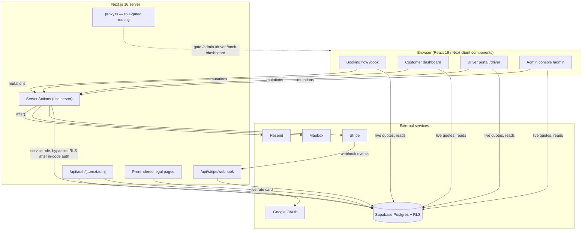

### Two database clients, deliberately separated

| Client | Key | Used by | RLS |
|---|---|---|---|
| **Anon / user JWT** | `NEXT_PUBLIC_SUPABASE_ANON_KEY` + session token | Browser reads, some user-scoped writes | **Enforced** |
| **Service role** | `SUPABASE_SERVICE_ROLE_KEY` | Server Actions only, after an in-code auth check | **Bypassed** |

The service role is `import "server-only"` and never reaches the client bundle. Every privileged mutation (verify driver, set commission, capture payment, publish rates) goes through the service role **behind** a `requireSession(role)` gate.

---

## 4. Data model

Nine tables. Row counts are live as of writing.

```mermaid
erDiagram
    profiles ||--o{ user_roles : has
    profiles ||--o{ bookings : "places (customer_id)"
    profiles ||--|| drivers : "is (user_id)"
    drivers ||--o{ bookings : "drives (driver_id)"
    drivers ||--o{ driver_documents : uploads
    vehicles ||--o{ bookings : "booked as"
    bookings ||--o{ payments : "ledger"
    pricing_config ||..|| bookings : "priced by (snapshot)"
    tariff_destinations ||..o{ bookings : "resolves tariff"

    profiles { uuid id PK "= auth.users.id" text email text full_name text phone }
    user_roles { uuid user_id FK "app_role: customer|driver|admin|pricing" }
    bookings { uuid id PK uuid customer_id FK uuid driver_id FK "booking_status" "payment_status" numeric fare_estimate jsonb stops text start_otp }
    drivers { uuid id PK uuid user_id FK bool is_verified numeric commission_rate numeric total_earnings }
    vehicles { uuid id PK "vehicle_type" numeric base_rate numeric hourly_rate numeric tariff_multiplier int sort_order }
    payments { uuid id PK uuid booking_id FK numeric amount text stripe_id }
    pricing_config { uuid id PK bool is_active numeric hst_rate numeric tariff_markup_rate "...18 rates" }
    tariff_destinations { text name PK numeric tariff }
    driver_documents { uuid id PK uuid driver_id FK text doc_type text file_url }
```

### Enums (live)

| Enum | Values |
|---|---|
| `app_role` | `customer`, `driver`, `admin`, `pricing` |
| `booking_status` | `pending`, `confirmed`, `driver_assigned`, `accepted`, `in_progress`, `completed`, `cancelled`, `rejected` |
| `payment_status` | `pending`, `authorized`, `paid`, `refunded`, `failed` |
| `vehicle_type` | `sedan`, `business`, `suv`, `limousine`, `party_bus` |
| `doc_status` | `pending`, `approved`, `rejected` |

### `bookings` — the fare snapshot (why prices are stable)

Each booking freezes what it was priced at, so later config changes cannot rewrite history:

`base_fare`, `markup_amount`, `airport_fee`, `tax_amount`, `fare_estimate` (= pre-tax subtotal), `tip`, plus payment lifecycle columns `authorized_at`, `captured_at`, `auth_expires_at`, and cancellation columns `cancellation_penalty_rate`, `cancellation_penalty`, `refund_amount`, `stripe_refund_id`. A DB trigger (`prevent_booking_payout_tamper`) freezes every money column against client writes.

**Invariant:** `base_fare + markup_amount + airport_fee = fare_estimate` (the tariff surcharge is folded into `base_fare` so this still holds).

### Database functions (RPCs)

| Function | Purpose | Security |
|---|---|---|
| `has_role(uid, role)` | Role check used inside RLS policies | `SECURITY DEFINER`, read-only |
| `start_ride_with_otp(ride, otp)` | Atomic OTP verify + status flip, re-checks assignee | `SECURITY DEFINER` |
| `credit_driver_earnings(driver, amount)` | **Atomic** `total_earnings += amount` | service_role only |
| `activate_pricing_config(id)` | **Atomic** rate-card version swap | service_role only |
| `prevent_driver_privilege_escalation` | Blocks self-setting `is_verified`/`commission_rate` on INSERT+UPDATE | trigger |
| `prevent_booking_payout_tamper` | Freezes fare/payout/stop columns from client writes | trigger |
| `prevent_active_pricing_delete` | Refuses deleting the active rate card | trigger |

---

## 5. Security model — RLS + column grants + triggers

Three independent layers, because the live DB has twice had its grants reset to Supabase defaults (which hand `anon`/`authenticated` full table access) and silently overridden the column scheme.

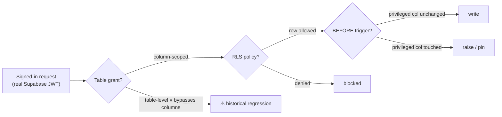

**Key protections, verified against the live DB with a simulated customer JWT:**

- **Drivers** — a customer cannot self-insert `is_verified=true` / `commission_rate=1.0` (was a full privilege escalation to "verified chauffeur earning 100% of every fare"). Blocked by grant + INSERT-covering trigger.
- **Bookings** — `start_otp` / OTP-attempt columns are withheld from `authenticated`; the assigned driver cannot read the passenger's start code via PostgREST.
- **user_roles** — SELECT only for clients; no one can self-grant `admin`/`driver`. Writes go through service-role actions behind an admin gate.
- **payments** — INSERT revoked; customers cannot forge ledger rows.
- **vehicles / pricing_config / tariff_destinations** — public SELECT of the active version, admin-only write.

The **verification suite** (`scripts/db-verify-rls.mjs`, `db-verify-driver-grants.mjs`) exercises these against the live DB inside a rolled-back transaction.

---

## 6. Authentication & authorization flow

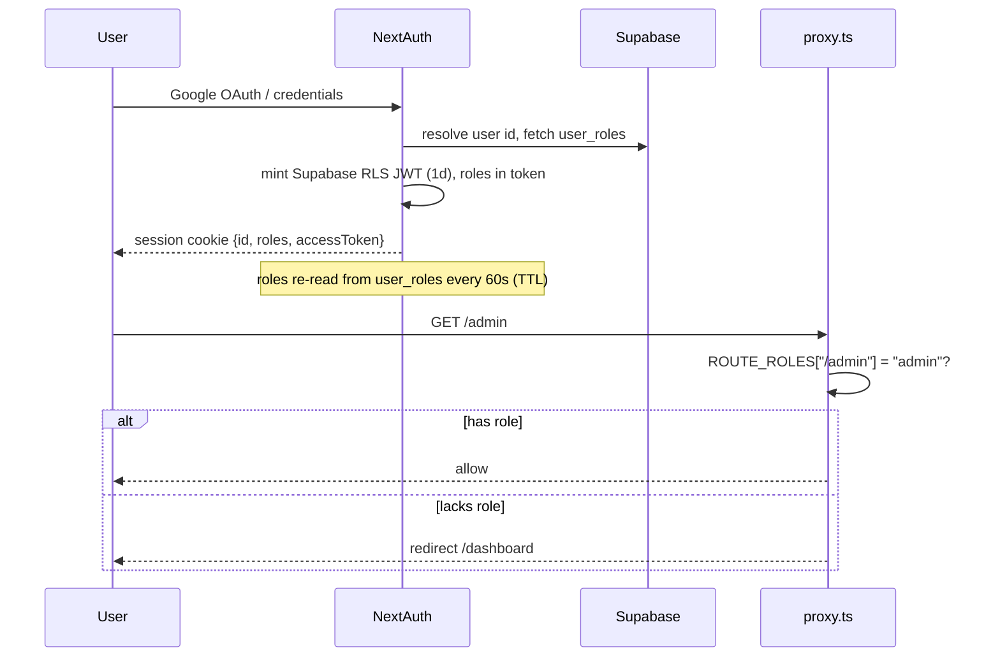

- **Roles refresh on a 60-second TTL.** Previously captured once at sign-in — so an approved chauffeur couldn't reach `/driver` until re-login, and a revoked admin kept powers for a day. Both directions now converge within a minute.
- **`pricing` is a capability, not a place.** It gates the rate-card publish action and is always held alongside another role. An admin can be created **without** it — a dispatcher who can confirm bookings but cannot reprice the business.
- Route gates live in `src/lib/roles.ts` (`ROUTE_ROLES`) and are enforced by `proxy.ts` on `/admin`, `/driver`, `/book`, `/dashboard`.

---

## 7. Routes & surfaces

| Route | Access | Purpose |
|---|---|---|
| `/`, `/fleet`, `/pricing`, `/services`, `/about`, `/contact`, `/faq` | Public | Marketing |
| `/privacy`, `/terms`, `/refund-policy`, `/chauffeur-terms` | Public (prerendered) | Legal — **generated from live constants/rate card** |
| `/become-chauffeur` | Public (auth to submit) | Driver application (11 required docs) |
| `/auth`, `/auth/error` | Public | Sign in |
| `/book` | Authenticated | The booking flow |
| `/dashboard` | Authenticated | Customer's bookings, pay, cancel, OTP |
| `/driver` | `driver` role | Assigned rides, accept/start/complete |
| `/admin` | `admin` role | Dispatch, fares, driver review, **rate card** |
| `/admin/analytics` | `admin` role | KPIs, revenue |
| `/api/stripe/webhook` | Stripe (signed) | Payment lifecycle events |
| `/api/auth/[...nextauth]` | NextAuth | OAuth callbacks |

---

## 8. The fare engine — how every calculation is done

This is the heart of the system. All of it lives in `src/lib/pricing.ts` + `src/lib/tariff.ts`, driven by the live **`pricing_config`** row.

### 8.1 Three trip types

| Trip type | Priced from | Formula |
|---|---|---|
| **Airport (Pearson)** | Official GTAA tariff | `tariff × vehicle multiplier`, then markup + fee + HST |
| **Airport (other)** | Vehicle base + meet & greet | `base + meetGreet + max(0, km − freeKm) × perKm` |
| **One-way** | Vehicle base + distance | `base + km × retailPerKm` (flat `base` if no coords) |
| **Hourly** | Vehicle hourly rate | `hourlyRate × max(minHours, hours)` |

### 8.2 The Pearson tariff resolution (`resolvePearsonTariff`)

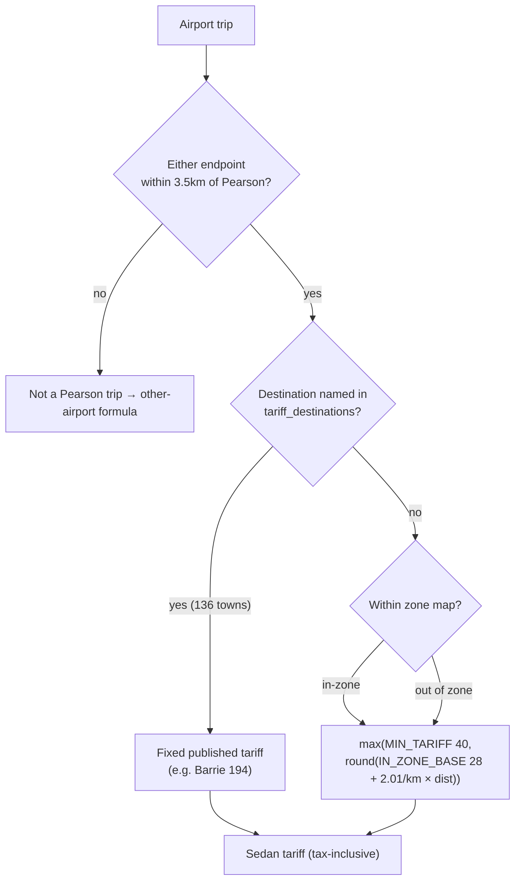

Key constants (now editable in `pricing_config`, seeded from these):

- `PEARSON_RADIUS_KM = 3.5`, `IN_ZONE_BASE = 28`, `tariff_per_km = 2.01`, `MIN_TARIFF = 40`
- **Vehicle class multipliers:** sedan 1.0, business 1.3, suv 1.3, limousine 2.5, party_bus 3.0
- The 136 out-of-town tariffs match the **official GTAA card (Feb 2024)** exactly (verified: Barrie 194, Guelph 162, Hanover 371…)

### 8.3 `priceBreakdown()` — the authoritative pipeline

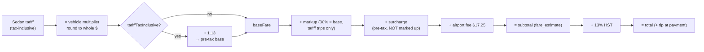

**The tax-inclusive correction (the big pricing change).** The GTAA card states *"All tariffs in Canadian dollars and includes taxes."* The engine was marking up **and** re-taxing that tax-inclusive number. Now a tariff is converted to its pre-tax equivalent before markup and HST, so tax is charged **once**:

| Trip | Before | After |
|---|---|---|
| T3 → 1 de Boers, sedan | $100.29 | **$90.99** |
| T3 → Downtown, sedan | $139.95 | **$126.10** |
| T3 → Barrie, sedan | $304.48 | **$271.69** |

Only Pearson **tariff** trips move (~11% down). Hourly / one-way / non-Pearson are byte-identical, because they price off the retail rate sheet which is genuinely pre-tax.

### 8.4 Tariff surcharges (from the official card)

| Surcharge | Rule | Auto-applied? |
|---|---|---|
| **Extra passenger / baggage** | $15 once per trip if >4 passengers **and/or** bags over the vehicle's rating | ✅ Yes — passed through at exactly $15 (sits outside `baseFare` so the markup never inflates it) |
| **Extra drop-off** | $15 per passenger dropped on route | ⚠ Reference only — a booking doesn't say who gets out where |
| **Requested stop wait** | $10 per 10 min | ⚠ Reference only — wait time unknown until the ride happens |
| **407 tolls** | At cost | Not implemented — dispatch adds manually |

### 8.5 Worked example — YYZ T3 → 1 de Boers Drive, Executive Sedan

```
GTAA sedan tariff for de Boers zone (tax-inclusive) .. 55.00
  ÷ 1.13 → pre-tax base .............................. 48.67
  + 30% markup ....................................... 14.60
  + airport fee ...................................... 17.25
  = subtotal (fare_estimate) ......................... 80.52
  + 13% HST .......................................... 10.47
  = total ............................................ 90.99   ✅ live value
```
_(Downtown sedan tariff resolves to 82 → total **$126.10**. SUV applies the 1.3 multiplier.)_

### 8.6 True unit economics (`rideMargin`)

Stripe's fee was previously modelled **nowhere**, overstating every margin. On the T3→de Boers sedan at $90.99:

```
customer pays ................. 90.99
 − HST (to CRA) ............... 10.47   pass-through, not revenue
 − GTAA fee (to airport) ...... 17.25   pass-through, not revenue
 = payout base ................ 63.27
 − driver share (75%) ......... 47.45
 = gross ...................... 15.82
 − Stripe (~2.9% + $0.30) ..... 2.94   ← 18% of gross; was invisible
 = NET PER RIDE ............... 12.88
```

The admin rate-card panel shows this **net** next to every sample fare.

---

## 9. Driver payout calculation

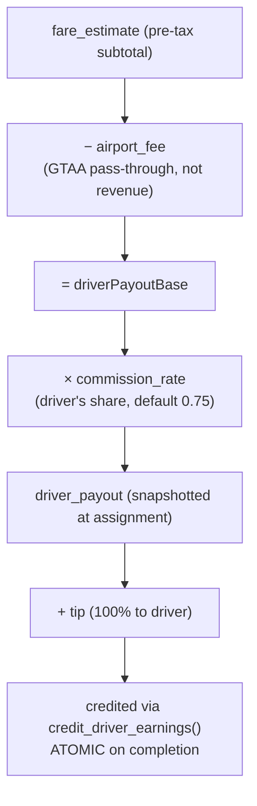

- `commission_rate` stores the **driver's** share (0.75 = chauffeur keeps 75%, platform commission 25%).
- The airport fee is **excluded** — it's the GTAA's money, not the business's revenue.
- `credit_driver_earnings` is a single-statement atomic increment: two rides completing simultaneously can no longer lose an update.
- Payout is snapshotted at assignment, so later rate changes don't alter money already owed.

---

## 10. Payment lifecycle — authorize then capture

The business holds the money at booking and charges after the ride.

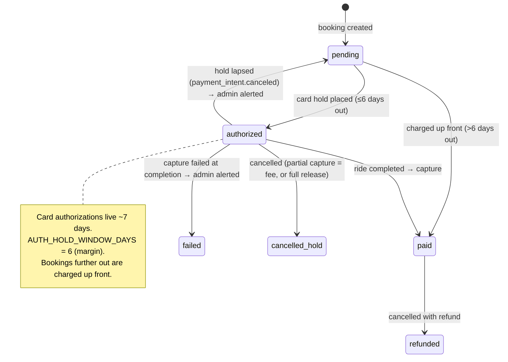

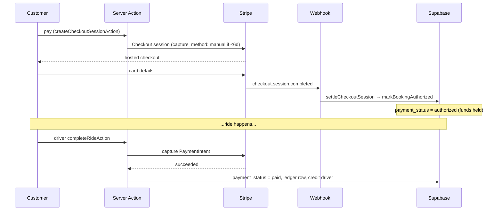

**Edge cases handled:**
- **Hold lapses before the ride** → `payment_intent.canceled` webhook resets to `pending` + emails admin (was a silent free ride).
- **Capture fails at completion** → `payment_status = failed` + admin alert; the driver is still credited (the ride happened).
- **Malformed `booking_id` in a webhook** → treated as "not ours", returns 200 (was an infinite Stripe retry loop).
- **Stale checkout sessions** → `expireOpenCheckoutSessions` auto-paginates so a fare change can't be paid at the old price.

---

## 11. Cancellation & refund ladder

`src/lib/cancellation.ts` — penalty is a fraction of the **taxed** fare (fare + HST); the tip is **always** refunded in full.

| Time before pickup | Penalty kept | Refund |
|---|---|---|
| More than 12h | 0% | 100% |
| 12h – 6h | 25% | 75% |
| 6h – 15min | 50% | 50% |
| 15min – pickup | 75% | 25% |
| At/after pickup | 100% | 0% |

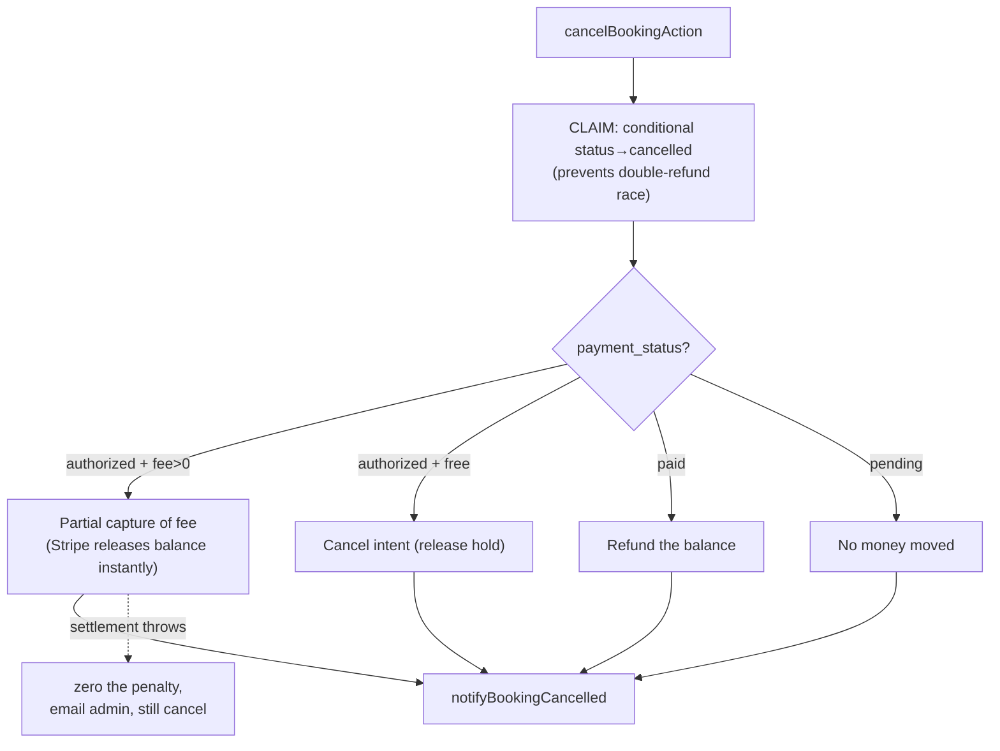

Timezone-correct: pickup times are stored as wall-clock-encoded-as-UTC (`"6pm" → "18:00Z"`), so the ladder resolves the true instant through `America/Toronto` before comparing — otherwise every ride looked hours closer than it was.

**⚠ OPEN — the ladder above (14 Jul instruction) contradicts a policy the same client approved on 6 Jul** (full refund beyond 24h, 50% at 12–24h, nothing inside 12h). At 8h out, one refunds half, the other nothing. Needs a decision.

---

## 12. Booking flow (customer)

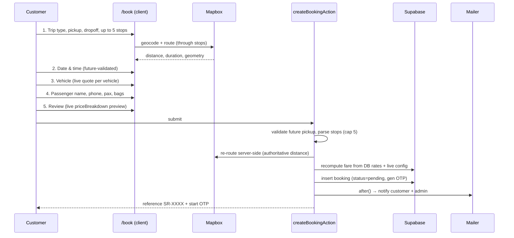

**Six steps:** Trip → Date/Time → Vehicle → Passenger → Payment → Confirmed. The preview uses `usePricingConfig()` (live rate card); the **server ignores it and recomputes**.

- **Up to 5 stops**, stored as ordered JSONB, routed through in order, capped and coordinate-validated at the trust boundary (`parseStops`).
- **Future-time validation** client + server, resolved through `pickupInstant` (handles the wall-clock/DST trap).
- **Passenger + bag counts** drive the tariff surcharge (both now collected; capacity-validated against the vehicle).

---

## 13. Full booking status lifecycle

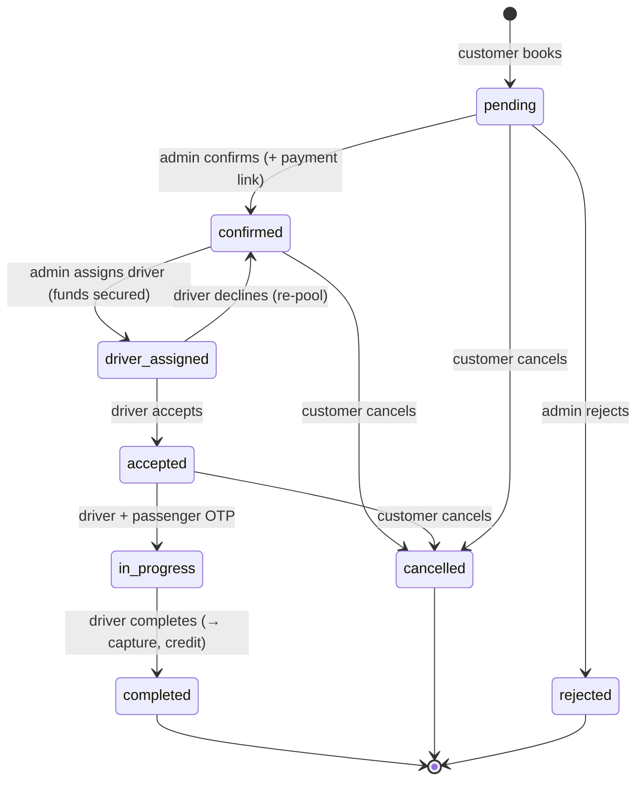

**The OTP gate** (`start_ride_with_otp`): the passenger reads a 4-digit code from their dashboard and hands it to the driver, who submits it to start the ride. The RPC re-verifies the assigned driver, checks the code, and enforces an attempt limit — all atomically, server-side. The driver **cannot** read the code themselves (column grant).

---

## 14. Driver onboarding

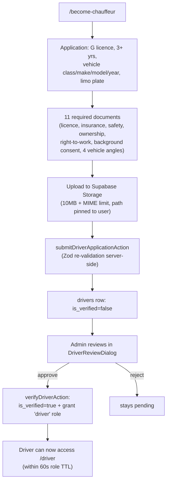

- Eligibility enforced server-side: full Ontario G, 3+ years, luxury sedan/SUV on a limo plate.
- Terms acceptance recorded with a server-stamped timestamp + version.
- Storage paths validated to the caller's own `${userId}/` prefix; unknown doc types dropped.

---

## 15. Admin capabilities

| Capability | Action | Gate |
|---|---|---|
| Confirm booking | `confirmBookingAction` | `admin` |
| Reject booking | `rejectBookingAction` | `admin` |
| Assign driver | `assignDriverAction` (payment must be secured) | `admin` |
| Change fare | `updateBookingFareAction` (reason required, pending only) | `admin` |
| Set driver commission | `setDriverCommissionAction` | `admin` |
| Verify chauffeur | `verifyDriverAction` (grants driver role) | `admin` |
| **Publish rate card** | `publishPricingConfigAction` | **`pricing`** |

---

## 16. The rate-card management system

The rates are **data**, not code. 136 tariffs + 18 constants live in `pricing_config` / `tariff_destinations`.

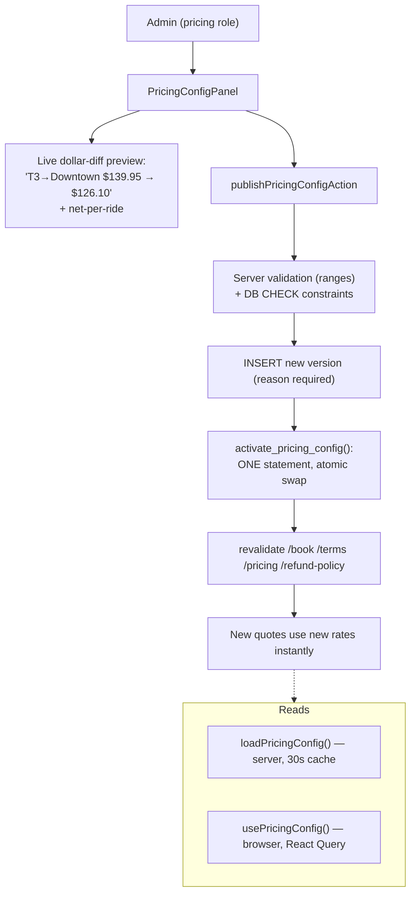

**Design guarantees:**
- **Isomorphic config** — `priceBreakdown(…, cfg)` takes the rate card as a parameter; the default equals the historical constants, so omitting it is a no-op. Server reads via `loadPricingConfig()` (cached, falls back to defaults, never throws). Client reads via `usePricingConfig()`.
- **Versioned, never overwritten** — publishing inserts a new row; the table is the audit log and rollback path. `reason` is `NOT NULL`.
- **Atomic activation** — `activate_pricing_config` flips `is_active = (id = _id)` in one statement, and raises on a bad id, so it can never leave **zero** active versions (which would silently drop every quote to the fallback).
- **Guard rails** — CHECK constraints reject fat-fingers (HST 0–25%, markup 0–200%). No code review exists on an admin form, so the DB is the backstop.
- **Legal pages stay in sync** — `/terms`, `/refund-policy`, `/pricing` are prerendered **from the live card** and revalidated on publish, so published policy can't drift from what's charged.

---

## 17. Notification system

Fire-and-forget (`after()`), non-throwing — a mail failure never breaks the action. All recipients/details loaded server-side; interpolation HTML-escaped.

| Event | Customer | Admin | Driver |
|---|---|---|---|
| Booking created | ✅ (+ OTP) | ✅ | |
| Booking confirmed | ✅ (pay link) | | |
| Payment received | ✅ | ✅ | |
| Driver assigned | ✅ | | ✅ |
| Driver accepted | ✅ | | |
| Ride completed | ✅ | | |
| Booking cancelled | ✅ | ✅ | |
| **Payment hold released** | | ✅ | |
| **Capture failed** | | ✅ | |
| Driver application | | ✅ | |

---

## 18. External integrations summary

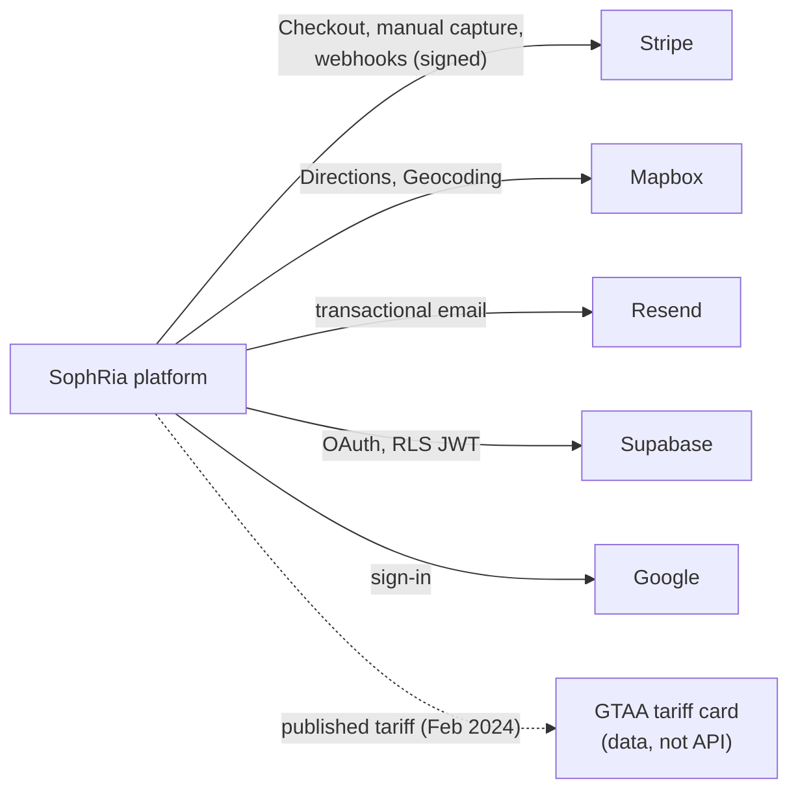

---

## 19. Module reference

| Module | Responsibility |
|---|---|
| `lib/pricing.ts` | Fare engine — `quote`, `priceBreakdown`, `tariffSurcharge`, `driverPayoutBase` |
| `lib/pricing-config.ts` | Rate-card type, defaults, `rideMargin` (isomorphic) |
| `lib/pricing-config.server.ts` | `loadPricingConfig` (cached), tariff-destination loader |
| `lib/pricing-actions.ts` | `publishPricingConfigAction` |
| `lib/tariff.ts` | GTAA tariff resolution, 136 destinations, class multipliers |
| `lib/cancellation.ts` | Refund ladder, penalty quote |
| `lib/payments.ts` | Stripe capture/refund/authorize/release (server-only) |
| `lib/payment-actions.ts` | Checkout session creation + verification |
| `lib/payment-window.ts` | `canHoldUntil`, `AUTH_HOLD_WINDOW_DAYS` (isomorphic) |
| `lib/actions.ts` | All booking/driver server actions |
| `lib/datetime.ts` | Wall-clock/UTC/Toronto resolution, future validation |
| `lib/stops.ts` | Stop parsing, cap, coordinate validation |
| `lib/driver-application.ts` / `driver-docs.ts` | Application schema, document set |
| `lib/mapbox.ts` | Directions, geocoding, route geometry |
| `lib/mailer/*` | Transactional notifications |
| `lib/roles.ts` | Route→role map, default landing |
| `lib/data-source.ts` | Mock-vs-Supabase switch (opt-in mock) |
| `auth.ts` | NextAuth config, JWT + role refresh |
| `proxy.ts` | Route-level role enforcement |

---

## 20. Known open items

| Item | Status |
|---|---|
| **Cancellation ladder** contradicts 6 Jul policy | ⚠ Needs client decision |
| **30% markup** on the tariff | Now editable; keep-or-change is a business call |
| Extra drop-off / stop-wait charges | Reference-only; dispatch applies manually |
| 407 tolls | Not automated |
| `admin` still broad for dispatch actions | `pricing` split done; other actions still flat |
| Advance bookings (>6 days) | Charged up front — save-card-off-session flow not built |
| Logo asset | Slot ready; file must come from client |
| Legal pages | Not lawyer-reviewed (stated in source) |
| 15 pre-existing lint errors | In untouched components; deferred |
| **Grant regressions** | Recur on DB restore; re-run the lock migrations if `relacl` shows `arw` |

---

## 21. Deployment & environments

- **No staging.** `.env.local` points at the production Supabase project and `limo.sophria.ca`.
- **Stripe** is test-mode in local dev; **Resend** is a live key (test bookings email the real admin).
- **Migrations** are applied one-by-one via `scripts/db-apply-migration.mjs` (no ledger table). All rate-card + security migrations are **already applied to production**; the branch code that uses them is committed on `feat/client-requirements-july`, pending merge to `main`.
- Hosting is Vercel in the client's account; production deploy happens on merge to `main`.

---

_Generated from the live schema and source on `feat/client-requirements-july`. Diagrams render on GitHub (Mermaid)._
